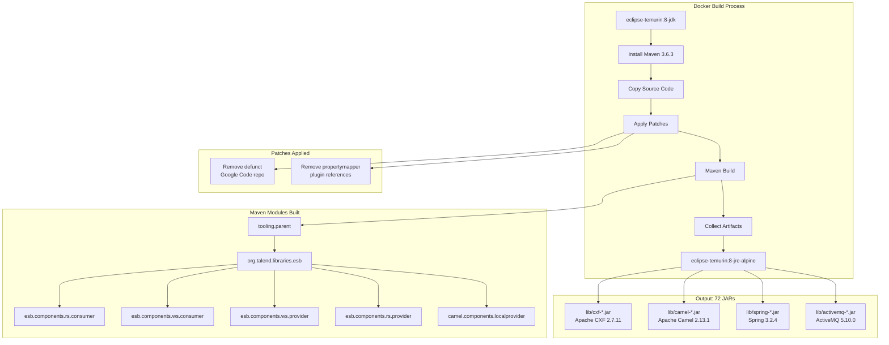
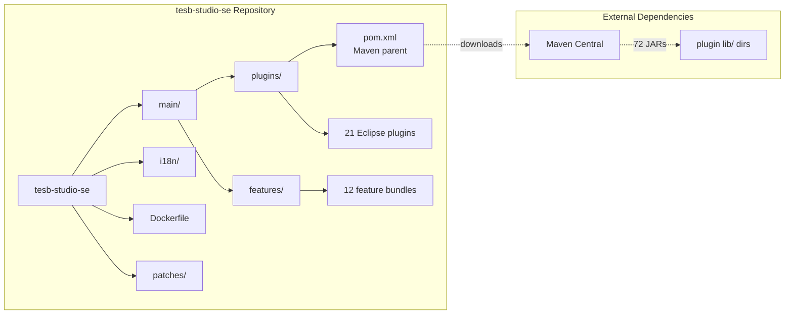
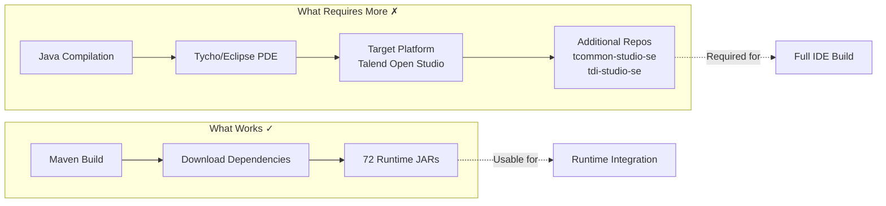
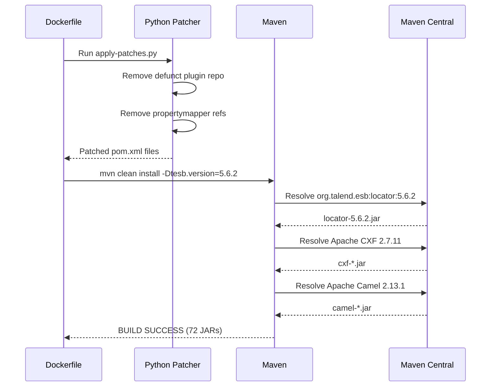

# Talend ESB Studio SE - Build Architecture

## Docker Build Flow

```mermaid
flowchart TB
    subgraph "Docker Build Process"
        A[eclipse-temurin:8-jdk] --> B[Install Maven 3.6.3]
        B --> C[Copy Source Code]
        C --> D[Apply Patches]
        D --> E[Maven Build]
        E --> F[Collect Artifacts]
        F --> G[eclipse-temurin:8-jre-alpine]
    end

    subgraph "Patches Applied"
        D --> D1[Remove defunct<br/>Google Code repo]
        D --> D2[Remove propertymapper<br/>plugin references]
    end

    subgraph "Maven Modules Built"
        E --> M1[tooling.parent]
        M1 --> M2[org.talend.libraries.esb]
        M2 --> M3[esb.components.rs.consumer]
        M2 --> M4[esb.components.ws.consumer]
        M2 --> M5[esb.components.ws.provider]
        M2 --> M6[esb.components.rs.provider]
        M2 --> M7[camel.components.localprovider]
    end

    subgraph "Output: 72 JARs"
        G --> O1[lib/cxf-*.jar<br/>Apache CXF 2.7.11]
        G --> O2[lib/camel-*.jar<br/>Apache Camel 2.13.1]
        G --> O3[lib/spring-*.jar<br/>Spring 3.2.4]
        G --> O4[lib/activemq-*.jar<br/>ActiveMQ 5.10.0]
    end
```

## Repository Structure

```mermaid
graph LR
    subgraph "tesb-studio-se Repository"
        ROOT[tesb-studio-se]
        ROOT --> MAIN[main/]
        ROOT --> I18N[i18n/]
        ROOT --> DOCKER[Dockerfile]
        ROOT --> PATCHES[patches/]

        MAIN --> PLUGINS[plugins/]
        MAIN --> FEATURES[features/]

        PLUGINS --> POM[pom.xml<br/>Maven parent]
        PLUGINS --> P1[21 Eclipse plugins]

        FEATURES --> F1[12 feature bundles]
    end

    subgraph "External Dependencies"
        MAVEN[Maven Central]
        POM -.->|downloads| MAVEN
        MAVEN -.->|72 JARs| LIB[plugin lib/ dirs]
    end
```

## Build vs Full Compilation

```mermaid
flowchart LR
    subgraph "What Works ✓"
        A1[Maven Build] --> A2[Download Dependencies]
        A2 --> A3[72 Runtime JARs]
    end

    subgraph "What Requires More ✗"
        B1[Java Compilation] --> B2[Tycho/Eclipse PDE]
        B2 --> B3[Target Platform<br/>Talend Open Studio]
        B3 --> B4[Additional Repos<br/>tcommon-studio-se<br/>tdi-studio-se]
    end

    A3 -.->|"Usable for"| RUNTIME[Runtime Integration]
    B4 -.->|"Required for"| IDE[Full IDE Build]
```

## Dependency Resolution

```mermaid
sequenceDiagram
    participant D as Dockerfile
    participant P as Python Patcher
    participant M as Maven
    participant MC as Maven Central

    D->>P: Run apply-patches.py
    P->>P: Remove defunct plugin repo
    P->>P: Remove propertymapper refs
    P-->>D: Patched pom.xml files

    D->>M: mvn clean install -Dtesb.version=5.6.2
    M->>MC: Resolve org.talend.esb:locator:5.6.2
    MC-->>M: locator-5.6.2.jar
    M->>MC: Resolve Apache CXF 2.7.11
    MC-->>M: cxf-*.jar
    M->>MC: Resolve Apache Camel 2.13.1
    MC-->>M: camel-*.jar
    M-->>D: BUILD SUCCESS (72 JARs)
```
